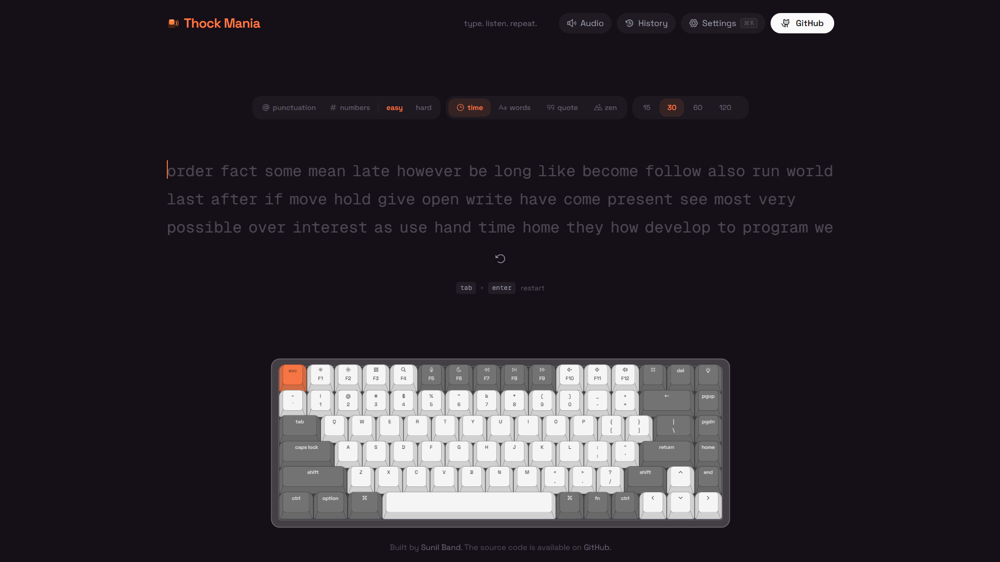

<a name="readme-top"></a>



<p align="center">
  <h3 align="center">Thock Mania</h3>
  <p align="center">
    A free typing test with realistic mechanical keyboard sounds
    <br />
    <a href="https://thockmania.sunilband.com/"><strong>Try it live »</strong></a>
    <br />
    <br />
    <a href="https://thockmania.sunilband.com/">Website</a>
    &middot;
    <a href="https://github.com/sunilband/thock-mania/issues">Issues</a>
    &middot;
    <a href="https://github.com/sunilband/thock-mania/issues/new?labels=enhancement&template=FEATURE_REQUEST_TEMPLATE.md">Request Feature</a>
  </p>
</p>

<p align="center">
  <a href="https://github.com/sunilband">
    
  </a>
  <a href="https://github.com/sunilband/thock-mania/stargazers">
    
  </a>
  <a href="https://github.com/sunilband/thock-mania/forks">
    
  </a>
  <a href="https://github.com/sunilband/thock-mania/blob/main/LICENSE">
    
  </a>
  <a href="https://www.typescriptlang.org/">
    
  </a>
  <a href="https://github.com/sunilband/thock-mania/commits/main">
    
  </a>
  <a href="https://github.com/sunilband/thock-mania/pulls">
    
  </a>
  
</p>

<details>
<summary>Table of Contents</summary>

- [About](#about)
- [Features](#-features)
- [Anti-Cheat](#-anti-cheat)
- [Tech Stack](#-tech-stack)
- [Getting Started](#-getting-started)
- [Scripts](#-scripts)
- [Contributing](#-contributing)
- [Follow Me](#-follow-me)
- [Deployment](#-deployment)
- [Give A Star](#-give-a-star)
- [Star History](#-star-history)


</details>

## About

**Thock Mania** is a free online typing test with **realistic mechanical keyboard sounds** and real-time WPM tracking. Practice with timed tests, word counts, quotes, or zen mode — featuring an interactive on-screen keyboard, satisfying key sounds, detailed accuracy stats, a global leaderboard, and Google sign-in to track your progress.

## ✨ Features

| Area | What you get |
|------|----------------|
| **Test modes** | Time (15s–120s), word count, quotes (length presets), zen |
| **Topic selector** | Pick a text category from the header — Random words (default, leaderboard-eligible), or practice with themed content: Famous quotes, Songs & music, Pop culture, History, Science, Technology, Nature, Sports, Literature, Philosophy. A "Random topic" option surprises you each test |
| **Caps Lock indicator** | A fixed bottom-left badge warns you when Caps Lock is active |
| **Mechanical key sounds** | Realistic per-key audio feedback via Web Audio; multiple keyboard themes |
| **Virtual keyboard** | Interactive on-screen keyboard that highlights keys as you type, with a header dropdown to switch form factors — 100% (full-size), 96%/1800, 80% TKL, 75%, 65%, 60%, and 40% |
| **Mobile typing** | Tap to focus and type with the device's soft keyboard — input is captured reliably across iOS and Android (Gboard), including autocorrect and swipe |
| **Results** | WPM, raw speed, accuracy, character breakdown, consistency, elapsed time, WPM-over-time chart |
| **Global leaderboard** | Compete for the top spot — one entry per user (your best WPM), powered by Supabase |
| **Google sign-in** | Sign in with Google to save your history to the cloud and appear on the leaderboard |
| **Visitor count** | Live "thocks and counting" counter in the header showing total unique visitors |
| **Cloud history** | When signed in, test history is stored in the database (falls back to localStorage when signed out) |
| **Local history** | Every completed test is logged on-device — review recent runs plus average and best WPM from the History panel (`⌘H`) |
| **Keyboard themes** | 7 color schemes — Classic, Mint, Royal, Dolch, Sand, Scarlet, Carbon — each tints the entire UI |
| **Typing fonts** | 9 fonts — Geist Mono, JetBrains Mono, Fira Code, IBM Plex Mono, Source Code Pro, Inter Tight, Space Grotesk, Nunito, Atkinson Hyperlegible |
| **Caret styles** | Line, block, or underline caret |
| **Settings** | Theme (light/dark/system), accent color, font picker, caret style, show keyboard, keyboard layout size, sound volume, live WPM, ghost mode, topic |
| **Haptics** | Optional vibration on supported hardware |
| **Anti-cheat** | Scores are computed and verified **server-side** — the leaderboard only accepts genuine, ranked runs (see [Anti-Cheat](#-anti-cheat)). Themed-topic practice runs are signed as unranked and never persisted |

Settings and history persist in `localStorage` — no account required. Sign in with Google to unlock cloud history and the leaderboard.

## 🛡 Anti-Cheat

The leaderboard is only worth competing on if the scores are real. Because a typing test runs in your browser, the page *could* lie about your WPM — so **Thock Mania never trusts the score the browser reports. The server computes it.**

Here's how a run is kept honest:

1. **The server picks the words.** When a test starts, the server generates the word list and signs it into a tamper-proof token (HMAC). You type against exactly those words — you can't substitute easier text, and the token can't be altered, reused, or used by someone else without breaking the signature.

2. **The server recomputes your score.** On submit, the browser sends only the raw run — which words you typed and the timestamp of every keystroke. The server recalculates WPM, accuracy, and character counts itself, against its own word list. Whatever number the page displayed is irrelevant.

3. **Keystroke timing must look human.** The server inspects the timing of every keystroke and rejects anything physically impossible — superhuman speed, near-instant bursts, or the perfectly even cadence of an auto-typer. This is what stops a script from "typing" a perfect run in milliseconds.

4. **Only the server can write to the leaderboard.** Database rules (Row Level Security) block the browser from inserting scores directly. Writes happen exclusively through a privileged server key, and column-level constraints reject impossible values as a final backstop.

The result: cheating goes from "edit one number in the dev tools" (which no longer works) to "build a bot that simulates believable human typing." That's a much higher bar. No client-side game can be made 100% tamper-proof, but trivial cheating is shut down and the leaderboard reflects genuine runs.

> Full write-up: see [`docs/SECURITY-RCA.md`](docs/SECURITY-RCA.md) for the root-cause analysis of the vulnerabilities and exactly how each was fixed.

> Self-hosting? The leaderboard needs `SUPABASE_SERVICE_ROLE_KEY` and `TEST_SIGNING_SECRET` set, plus migrations `003`/`004` applied (see [Getting Started](#-getting-started)). Without them, runs save locally but aren't submitted.

## 🛠 Tech Stack

<details><summary><b>Thock Mania</b> is built using the following technologies:</summary>

- [TypeScript](https://www.typescriptlang.org/): Typed superset of JavaScript.
- [Next.js](https://nextjs.org/) 16: React framework with App Router.
- [React](https://react.dev/) 19: UI library.
- [Tailwind CSS](https://tailwindcss.com/): Utility-first CSS framework.
- [Supabase](https://supabase.com/): Auth, Postgres database, and real-time backend.
- [Base UI](https://base-ui.com/): Unstyled, accessible component primitives from MUI.
- [shadcn/ui](https://ui.shadcn.com/): Pre-styled component recipes.
- [Motion](https://motion.dev/): Animation library for React.
- [Recharts](https://recharts.org/): Composable charting library.
- [Biome](https://biomejs.dev/): Fast linter and formatter.
- [Serwist](https://serwist.pages.dev/): PWA / service worker toolkit.
- [Vercel](https://vercel.com/): Deployment platform.

</details><br/>

[](https://github.com/sunilband)

## 🧰 Getting Started

1. Make sure [Git](https://git-scm.com/downloads) and [Bun](https://bun.sh/) (or Node.js 20+) are installed.
2. Fork this repository and clone **your fork**:

   ```bash
   git clone https://github.com/<your-username>/thock-mania.git
   cd thock-mania
   ```

3. Create a `.env.local` file with your Supabase credentials:

   ```env
   NEXT_PUBLIC_SUPABASE_URL=your-supabase-url
   NEXT_PUBLIC_SUPABASE_PUBLISHABLE_KEY=your-supabase-anon-key

   # Required for the leaderboard (server-side anti-cheat). Without these,
   # runs save to localStorage only and are never submitted.
   SUPABASE_SERVICE_ROLE_KEY=your-supabase-service-role-secret   # server-only, never expose
   TEST_SIGNING_SECRET=a-stable-random-string                    # e.g. `openssl rand -hex 32`
   ```

4. Run the SQL migrations in your Supabase SQL Editor, in order:
   - `supabase/migrations/001_initial_schema.sql`
   - `supabase/migrations/002_anonymous_users.sql`
   - `supabase/migrations/003_score_integrity.sql` (anti-cheat value constraints)
   - `supabase/migrations/004_lock_down_result_inserts.sql` (anti-cheat: server-only writes)

5. Enable Google as an auth provider in Supabase → Authentication → Providers.

6. Install dependencies and start the dev server:

   ```bash
   bun install
   bun dev
   ```

7. Open [http://localhost:3000](http://localhost:3000) in your browser.

> **Note**: The app works fully without Supabase — you just won't have the leaderboard, cloud history, or visitor count. All typing test features work with localStorage alone.

## 📜 Scripts

| Command | Description |
|--------|-------------|
| `bun dev` | Development server |
| `bun run build` | Optimized production build |
| `bun start` | Serve the production build |
| `bun run lint` | Lint with Biome |
| `bun run lint:fix` | Lint and auto-fix with Biome |
| `bun run format` | Format with Biome |
| `bun run typecheck` | Type-check with TypeScript |

## 🔧 Contributing

[](https://github.com/sunilband/thock-mania/graphs/contributors)

Contributions are what make the open source community such an amazing place to learn, inspire, and create. Any contributions you make are **greatly appreciated**.

1. Fork the repo
2. Create a new branch (`git checkout -b improve-feature`)
3. Make the appropriate changes in the files
4. Commit your changes (`git commit -am 'Improve feature'`)
5. Push to the branch (`git push origin improve-feature`)
6. Create a Pull Request

## 🚀 Follow Me

[](https://github.com/sunilband "Follow Me")

## 📃 Deployment

| Method                     | Description                              | Action                                                                                                                                                         |
| :------------------------- | :--------------------------------------- | :------------------------------------------------------------------------------------------------------------------------------------------------------------- |
| **🔧 Manual Build**        | Create an optimized production build.    | `bun run build`                                                                                                                                                |
| **▲ Vercel (Recommended)** | Deploy instantly on the Vercel platform. | [](https://vercel.com/new/clone?repository-url=https%3A%2F%2Fgithub.com%2Fsunilband%2Fthock-mania)               |
| **🌐 Netlify**             | Deploy easily on Netlify.                | [](https://app.netlify.com/start/deploy?repository=https://github.com/sunilband/thock-mania) |

For more details, check the [Next.js deployment docs](https://nextjs.org/docs/deployment).

## ⭐ Give A Star

If you found this project useful, give it a star to help more people discover it!

## 🌟 Star History

<a href="https://star-history.com/#sunilband/thock-mania&Timeline">
<picture>
  <source media="(prefers-color-scheme: dark)" srcset="https://api.star-history.com/svg?repos=sunilband/thock-mania&type=Timeline&theme=dark" />
  <source media="(prefers-color-scheme: light)" srcset="https://api.star-history.com/svg?repos=sunilband/thock-mania&type=Timeline" />
  
</picture>
</a>

<br />
<p align="right">(<a href="#readme-top">back to top</a>)</p>
